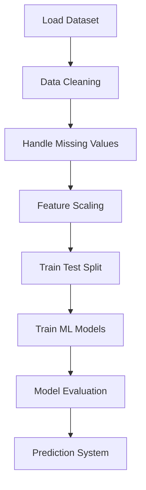

# 💧 Water Potability Prediction using Machine Learning


A **Machine Learning classification project** that predicts whether water is **safe for drinking (Potable) or not** based on various **water quality parameters**.

This project demonstrates a **complete end-to-end Machine Learning workflow**, including:

* Data cleaning
* Missing value handling
* Feature scaling
* Model training
* Model evaluation
* Visualization
* Model comparison

---

# 📌 Project Overview

Water quality is a critical factor for **human health and environmental sustainability**.

In this project, Machine Learning models are used to analyze **chemical properties of water** and determine whether the water is **potable (safe to drink)**.

The model predicts:

```
1 → Potable (Safe for Drinking)
0 → Not Potable
```

---

# 🧠 Machine Learning Pipeline



This represents the **complete ML lifecycle implemented in the project**.

---

# 📊 Dataset Information

Dataset: **Water Potability Dataset**

| Feature         | Description                             |
| --------------- | --------------------------------------- |
| ph              | pH value of water                       |
| Hardness        | Calcium & Magnesium concentration       |
| Solids          | Total dissolved solids                  |
| Chloramines     | Chlorine concentration                  |
| Sulfate         | Sulfate concentration                   |
| Conductivity    | Electrical conductivity                 |
| Organic Carbon  | Organic carbon level                    |
| Trihalomethanes | Chemical compounds from water treatment |
| Turbidity       | Cloudiness of water                     |

### Target Variable

| Value | Meaning     |
| ----- | ----------- |
| 1     | Potable     |
| 0     | Not Potable |

---

# ⚙️ Technologies Used

* **Python**
* **Pandas**
* **NumPy**
* **Matplotlib**
* **Seaborn**
* **Scikit-Learn**
* **Jupyter Notebook**

---

# 🤖 Machine Learning Models Used

The project experiments with multiple ML models:

### 1️⃣ Logistic Regression

Used for **binary classification problems**.

### 2️⃣ Decision Tree Classifier

Captures **non-linear relationships** between water quality parameters.

---

# 📈 Model Evaluation

Models are evaluated using:

* **Accuracy Score**
* **Confusion Matrix**
* **Classification Report**

These metrics help evaluate **model performance and prediction reliability**.

---

# 📊 Data Visualization

Data analysis and visualization include:

* Correlation heatmaps
* Feature distribution plots
* Model performance comparison

Libraries used:

* **Matplotlib**
* **Seaborn**

---

# 🔍 Prediction System

The trained model can take **water quality parameters as input** and predict whether the water is:

```
Potable
or
Not Potable
```

This demonstrates how Machine Learning can help in **automated water quality monitoring systems**.

---

# 🌍 Real World Applications

This type of system can be used in:

* Smart water quality monitoring
* Environmental data analysis
* Public health safety systems
* IoT-based water testing devices
* Government water safety programs

---

# 📂 Project Structure

```
Water-Potability-Prediction
│
├── Water_potability_test.ipynb
├── water_potability.csv
├── requirements.txt
├── README.md
```

---

# 🚀 How to Run the Project

### 1️⃣ Clone the repository

```bash
git clone https://github.com/your-username/water-potability-prediction.git
```

### 2️⃣ Navigate to the folder

```bash
cd water-potability-prediction
```

### 3️⃣ Install dependencies

```bash
pip install -r requirements.txt
```

### 4️⃣ Run the notebook

Open Jupyter Notebook and execute all cells.

---

# 🎯 Skills Demonstrated

* Data Cleaning
* Handling Missing Data
* Feature Scaling
* Machine Learning Model Training
* Model Evaluation
* Data Visualization
* Classification Algorithms

---

# 📸 Example Output

The trained model predicts:

```
Input → Water Quality Parameters
Output → Potable / Not Potable
```

---

# 👨‍💻 Author

**Taksh Samirkumar Patel**

Computer Science Engineering Student
Interested in **Artificial Intelligence | Machine Learning | Data Science**

🔗 LinkedIn
https://www.linkedin.com/in/taksh-patel-6a6b97325

💻 LeetCode
https://leetcode.com/u/5EWSbJZA6M/

---

⭐ If you found this project useful, consider giving it a **star** on GitHub!
